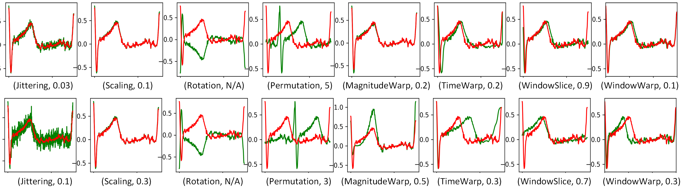
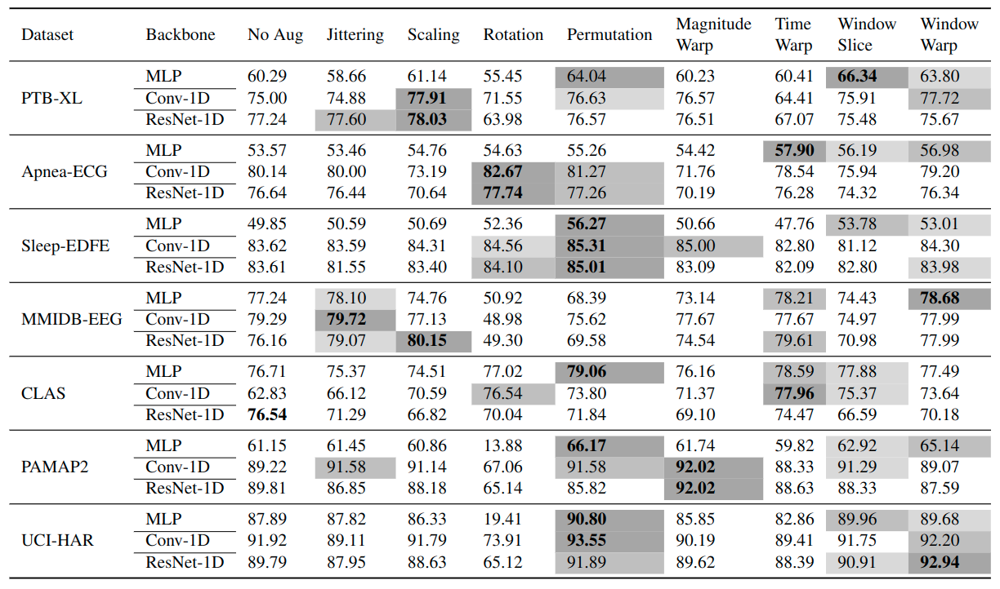

# Empirical Evaluation of Data Augmentations for Biobehavioral Time Series Data with Deep Learning.


This is the  Pytorch implementation for the empirical evaluation of data augmentation methods for wearable data.

:triangular_flag_on_post:**News**(May 06, 2022): Quantitatively measure the effectiveness of Data Augmentation methods.

:triangular_flag_on_post:**News**(April 06, 2022): Implement the Differentiable Automatic Data Augmentation method.

:triangular_flag_on_post:**News**(Mar 22, 2022): Implement the RandAugment method.

:triangular_flag_on_post:**News**(Mar 09, 2022): Edit the Readme file, and upload the project to Github 

:triangular_flag_on_post:**News**(Mar 08, 2022): Clean, rebuild the whole project, and all the backbone and DA methods have passed the test example.


<!-- ## Goals
There are several phases for this project:

- [x] A comprehensive and systematic evaluation of data augmentation methods on various biomedical time series datasets with different backbones for different tasks. The DA methods include `Jittering`, `Scaling`, `Rotation`, `Permutation`, `Magnitude warp`, `Time warp`,  `Window slice`, `Window warp`;
- [x] Exploring automatic data augmentation method for wearable data.  With different DA methods available, it is usually difficult to choose one or multiple DA methods for a task without actually trying individuals or their combination. It is time consuming and sometimes not feasible to find the optimal DA method, therefore an automatic DA method is desired for many applications. (`the whole project is significantly different with the DA project, therefore, I re-implement the project under the folder of DADA`).
- [x] Investigating effective and efficient DA method. Automatic DA method may work for various tasks, but the extra computational burden will hinder the wide adoption of such a method. We will explore DA methods that are not only effective but also efficient for various wearable data based applications.
 -->


## Requirements

- Python 3.7
- numpy
- Pytorch == 1.7 and later
- scikit_learn


## Data

The data used in this project comes from two main sources:

- the [UCR Time Series Archive](https://www.cs.ucr.edu/~eamonn/time_series_data_2018/), which contains 128 univariate time series datasets (including ECG data)
- The [PhysioNet](https://physionet.org/about/database/), which contains various physiological datasets.

<!-- 
```python
#To load the data, we can use:
data_dict = np.load("data_dict_interpolate.npy", allow_pickle=True).item()

#Then we will have a data dictionary with following format:
data_dict = {
    'gsr_train': gsr data sequence (train) Dimension:(2039, 60, 12),
    'ecg_train': ecg data sequence (train) Dimension:(2039, 60, 8),
    'gsr_mlabel_train': flags that indicate whether gsr data is missing   (train) Dimension:(2039, ),
    'ecg_mlabel_train': flags that indicate whether ecg data is missing   (train) Dimension:(2039, ), 
    'label_train': stress labels (train) Dimension:(2039, ),
    'gsr_test': gsr data sequence (test) Dimension:(874, 60, 12),
    'ecg_test': ecg data sequence (test) Dimension:(874, 60, 8),
    'gsr_mlabel_test': flags that indicate whether gsr data is missing   (test) Dimension:(874,),
    'ecg_mlabel_test': flags that indicate whether ecg data is missing   (test) Dimension:(874,), 
    'label_test': stress labels (test) Dimension:(874,)
}
``` -->

<!-- ## Features

- [ ] Need to investigate deep features that extracted from the raw signals, rather than the currently used hand-crafted features. -->

<!-- #### ECG:

Similar to GSR data, the dimension of ECG sequence is (60, 8). The used 8 features are:

| feature index | feature description                                          |
| ------------- | ------------------------------------------------------------ |
| 1             | Mean heart rate                                              |
| 2             | Standard deviation of heart rate variability's R-R intervals |
| 3             | Root mean square of successive R-R differences               |
| 4             | Low frequency signal (power in the 0.04-0.15 Hz band)        |
| 5             | High frequency signal (power in the 0.15-0.40 Hz band)       |
| 6             | Ratio of low and high frequency                              |
| 7             | Ratio of very low (0.0033 - 0.04 Hz) and low frequency       |
| 8             | Heart rate cycle                                             | -->

### Examples
<p align="center">

<br><br>
<b>Figure 1.</b> Examples of different data augmentation methods.
</p>


## Usage
To run a model on one dataset, you should issue the following command:

```bash
python ./main.py  --jitter   --data_dir=./data/   --train_data_file=data.tsv   --test_data_file=data.tsv  --model_weights_dir=./experiments  --log_dir=./logs  --num_epoches=50  --lr=0.001  --decay_rate=0.9  --step_size=5  --batch_size=100  --cuda_device=cuda:0  --model=resnet-1d   --input_length=750  --input_channels=1  --num_classes=42
```

The detailed descriptions about the arguments are as following:

| Parameter name   | Description of parameter                                     |
| ---------------- | ------------------------------------------------------------ |
| jitter           | using jitter augmentation method, other options include `scaling`, `permutation`,`rotation`,`magwarp`,`timewarp`,`windowslice`,`windowwarp`                            |
| data_dir         | folder to the data.                      |
| train_data_file  | filename of the training data |
| test_data_file   | filename of the testing data |
| model_weights_dir| folder to save model parameters  |
| log_dir          | folder to save log file|
| num_epoches      | training epoches|
| lr               | learning rate|
| decay_rate       | decay rate for learning rate |
| step_size        | learning rate will be decay by every step_size epoches |
| batch_size       |  batch size|
| cuda_device      |  the name of cuda device|  
| model            |  select one backbone model to use, including "mlp", "conv-1d", "resnet-1d"  |
| input_length     |  the length of the input sequence  |
| input_channels   |  the number of channels for the time series data |
| num_classes      |  the number of classes |


### Experimental Results
<p align="center">
<b>Table 1.</b> Performance in terms of 8 different DA methods and three backbones (MLP, Conv-1D and ResNet-1D) are reported on night datasets. Bold numbers indicate the best performance.Examples of different data augmentation methods. The top three most effective DA methods are colored in gray, and the grayscale represents the corresponding improvements.

<br><br>

</p>


## Related Works

Here are some related papers and Github projects.

### Papers
- Data Augmentation of Wearable Sensor Data for Parkinson’s Disease Monitoring using Convolutional Neural Networks (2017)[[Link](https://arxiv.org/pdf/1706.00527.pdf)]
- Data Augmentation for Time Series Classification using Convolutional Neural Networks (2016)[[Link](https://halshs.archives-ouvertes.fr/halshs-01357973/document)]
- Data Augmentation with Suboptimal Warping for Time-Series Classification (2020)[[Link](https://www.ncbi.nlm.nih.gov/pmc/articles/PMC6983028/)]
- Time Series Data Augmentation for Deep Learning: A Survey (IJCAI-2021)[[Link](https://www.ijcai.org/proceedings/2021/0631.pdf)]
- Role of Data Augmentation Strategies in Knowledge Distillation for Wearable Sensor Data (2022)[[Link](https://arxiv.org/pdf/2201.00111v1.pdf)]
- Transformer Networks for Data Augmentation of Human Physical Activity Recognition (2021)[[Link](https://arxiv.org/pdf/2109.01081.pdf)]
- ActivityGAN: generative adversarial networks for data augmentation in sensor-based human activity recognition (2020)[[Link](https://dl.acm.org/doi/abs/10.1145/3410530.3414367?casa_token=qycTqxQtn1wAAAAA%3ACt_7ICqrhXd8SZE15XoHZbKzvw41oCOvcVGlQuFoIgpnloCCB4OOxJYUm9QE5J0gXl5ktYmhc0f9)]

### Github projects
- [Time Series Augmentation](https://github.com/uchidalab/time_series_augmentation)
- [Deep Learning for Time Series Classification](https://github.com/hfawaz/dl-4-tsc)

## <span id="resultslink">Results</span>

To be continued.


## FAQ

None.

## Acknowledgement
We would like to thank the dataset providers of the [UCR Time Series Archive](https://www.cs.ucr.edu/~eamonn/time_series_data_2018/) and the [PhysioNet](https://physionet.org/about/database/). Part of the code credits to github project [Time Series Augmentation](https://github.com/uchidalab/time_series_augmentation) and [Deep Learning for Time Series Classification](https://github.com/hfawaz/dl-4-tsc)
